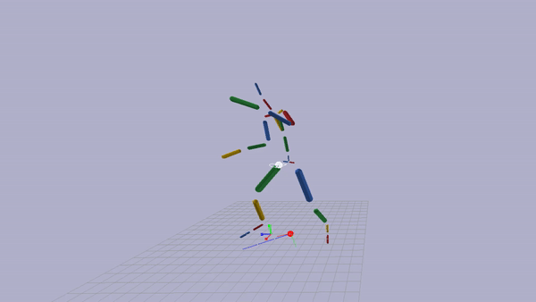

BVH Gym
===================================

===================================

Loads BVH animation file and plays animation on an articulated ragdoll in the bullet physics engine.

Controls:

	Enter: Play/Pause Animation

	Left / Right in Pause: frame by frame rewind or advance in animation

	Left / Right in Play: Make animation slower or faster

Usage:
	
	Drag & drop a bvh on the .exe to launch the application.
	
	Alternatively, you can use launch from the command line with the following syntax

	bvh_gym.exe [path_to_bvh] [options_list]

CMD Line options available:
	
	-noSkeleton: Do not display skeleton and joints in red wireframe (can help de-clutter the view).
	
	-noCOMState: Do not draw debug information about the Center Of Mass state.
	
	-noNormalize: BVH skeleton definitions vary in scales depending on the generating application, by default BVH_gym normalizes for easier viewing, this can be disabled.
	
	
